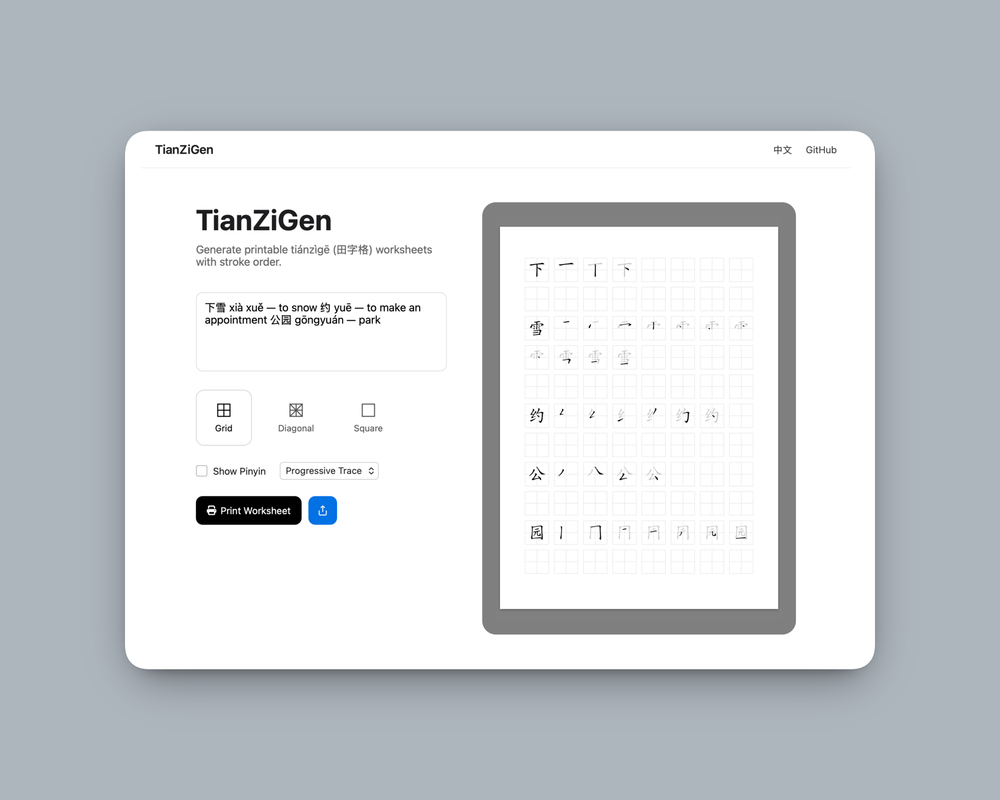

# TianZiGen

Generate printable tiánzìgē (田字格) worksheets with stroke order.

## Acknowledgments
- [jsPDF](https://github.com/parallax/jsPDF) — MIT License  
- [svg2pdf.js](https://github.com/yWorks/svg2pdf.js) — MIT License  
- [Hanzi Writer](https://github.com/chanind/hanzi-writer) — MIT License  
- [pinyin-pro](https://github.com/zh-lx/pinyin-pro) — MIT License  
- [Font Awesome](https://fontawesome.com) — CC BY 4.0 / MIT License  
